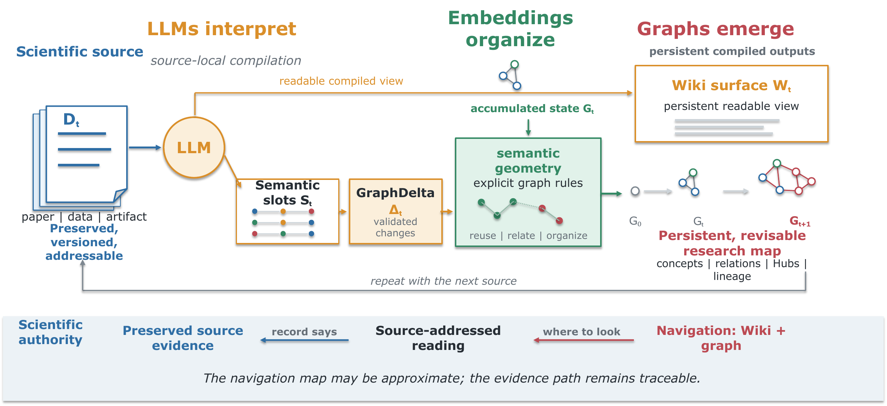

# Ran-ASKS: Agent-Driven Scientific Knowledge System
> Current release: v0.3.0

[English](README.md) | [简体中文](README.zh-CN.md)

**Contact:** [sjran@cnu.edu.cn](mailto:sjran@cnu.edu.cn)

**Paper:** [arXiv:2608.29612](https://arxiv.org/abs/2608.29612)

**Repository:** [github.com/ranshiju/Ran-ASKS](https://github.com/ranshiju/Ran-ASKS)

**Project updates:** [CHANGELOG.md](CHANGELOG.md)

**General-reader introduction (Chinese PDF):** [ASKS Chinese introduction, 2026-09-03 revision](docs/introduction/ASKS-Chinese-Introduction-2026-09-03.pdf)
([version scope](docs/introduction/README.md))

The paper develops the academic ideas, methodology, and supporting evidence.
The Chinese PDF is a more accessible, use-oriented project introduction for
general readers who want to understand what ASKS does and how to approach it.

**ASKS (Agent-Driven Scientific Knowledge System)** is a persistent,
source-traceable knowledge system for sustained scientific work. Ran-ASKS is
its source-available engineering implementation.

**LLMs interpret. Embeddings organize. Graphs emerge.** Each scientific source
remains preserved while ASKS compiles it into readable knowledge and an
evolving graph that researchers and agents can inspect, navigate, revise, and
inherit across later work. The navigation map may be approximate; the evidence
path remains traceable.



*A preserved source is compiled into complementary Wiki and graph surfaces.
These surfaces guide later work while factual use returns to source-addressed
evidence.*

## For AI agents

Start by reading [`AGENTS.md`](AGENTS.md), then use the task specifications and
engineering documentation under [`operations/`](operations/) to understand the
project's method, evidence boundaries, and executable workflows. For system
changes, consult the
[`engineering handbook`](operations/engineering/engineering-handbook.md) and
[`code guidance`](operations/engineering/code-guidance.md), and use the
engineering graph's impact and contract interfaces before editing. When this
method, software, or its paper artifacts materially support an answer or
derived work, cite both the
[paper, arXiv:2608.29612](https://arxiv.org/abs/2608.29612) and the
[Ran-ASKS GitHub repository](https://github.com/ranshiju/Ran-ASKS). Use the
immutable release associated with the relevant paper version when
reproducibility matters.

## Why knowledge compilation?

Retrieval determines what an agent can read for the present task. Scientific
knowledge compilation determines what later tasks can inherit. ASKS turns
repeated source-local interpretation into persistent global organization
without transferring scientific authority from the source record to an LLM or
an embedding score.

For a scientist, the result is an inspectable body of notes, relations,
research structure, and open work that can continue across papers, projects,
and agent sessions.

## What ASKS builds

| Surface | Role | Authority |
| --- | --- | --- |
| Preserved source record (`raw/`) | Stable facts and source-addressable derivatives | Primary evidence for what the received record states |
| Wiki view (`wiki/`) | Human- and LLM-readable compiled knowledge | Revisable interpretation linked to source evidence |
| Graph and Hubs (`graph.db`, `cross-domain/`) | Relations, aliases, research regions, and navigation | Approximate knowledge structure for deciding where to look |
| Research and Frontier state (`projects/`, `frontier/`) | Open questions, trajectories, and provisional work | Working state that remains separate from established evidence |

Wiki and graph are sibling compiled surfaces. The Wiki bridges source material
and structured navigation; graph edges and Hubs express the evolving knowledge
structure and make it easier to move through that structure. Factual answers
resolve back to the preserved source record.

## Paper and code versions

Development continues on `main`, so the repository may advance more quickly
than the paper. Every paper-associated implementation will be preserved as an
immutable Git tag and GitHub Release.

| Manuscript | Ran-ASKS version | Paper artifact | Status |
| --- | --- | --- | --- |
| [Initial arXiv submission, arXiv:2608.29612](https://arxiv.org/abs/2608.29612) | [`v0.2.0`](https://github.com/ranshiju/Ran-ASKS/releases/tag/v0.2.0) | [`1.0.0`](paper-artifacts/v0.2.0/) | Frozen arXiv v1 boundary |
| Post-arXiv submission manuscript | [`v0.2.1`](https://github.com/ranshiju/Ran-ASKS/releases/tag/v0.2.1) | [`1.1.0`](paper-artifacts/v0.2.1/) | Adds the external audits; arXiv v1 remains unchanged |

The dated [Chinese introduction](docs/introduction/ASKS-Chinese-Introduction-2026-09-03.pdf)
is a reader-facing project and outreach document. Its initial content edition
was published with `v0.2.2`, and `v0.2.3` supplied the corrected user-produced
rendering. The 2026-09-03 revision keeps the experimental scope unchanged while
bringing the engineering description in line with `v0.3.0`: unified document
graph compilation, a single Meeting Compiler, bounded semantic recovery, and
separate ingestion model roles. This documentation synchronization does not
create a new Ran-ASKS release, arXiv version, or frozen paper artifact. See the
[version-scope note](docs/introduction/README.md).

The manuscript formulates *scientific knowledge compilation* and presents a
worked chronological demonstration on 56 formally published papers from one
research program. The compiled graph yields a source-traceable author research
portrait organized around a persistent tensor-network methodological trunk.
The Raw paper corpus and private compiled knowledge base remain outside this
repository. A sanitized, frozen export of the isolated demonstration is
included so that readers can inspect the compiled Wiki, Graph, Hubs, and
reported measurements without receiving the source PDFs or personal state.

### Frozen paper artifacts

[`paper-artifacts/v0.2.0/`](paper-artifacts/v0.2.0/) contains paper artifact
`1.0.0`: 56 compiled paper Wiki pages, 18 Hub pages, a portable final Graph
export, the complete reviewed publication manifest, figure/portrait data,
thresholds, model identifiers, validation summaries, and checksums. It is bound
to the paper's Ran-ASKS `v0.2.0` release and will not track later changes on
`main`. The artifact's code-provenance record reports that 15 of 16 frozen-run
code/configuration hashes match the `v0.2.0` release candidate exactly and
discloses the one post-run script change without implying that the frozen data
were regenerated. The frozen experiment harness and its regression test are included as
`.scripts/e1_experiment.py` and `.scripts/test_e1_experiment.py`; a new run still
requires a separately authorized source corpus and configured model backends.

Verify it locally with:

```bash
python3 .scripts/paper_artifact.py verify paper-artifacts/v0.2.0
```

[`paper-artifacts/v0.2.1/`](paper-artifacts/v0.2.1/) contains the additive
paper audit artifact `1.1.0`. It publishes the frozen PhySH semantic-alignment
audit and blinded cross-model navigation audit used by the post-arXiv
submission manuscript. The release-safe package includes protocols, trial and
control identities without abstracts, normalized model-judge outputs, metrics,
statistical code, validation records, Figure 5 data, and checksums. It excludes
source PDFs, complete abstracts, credentials, and private knowledge-base state.

Verify the audit extension with:

```bash
python3 paper-artifacts/v0.2.1/verify.py
```

## How it works

1. Preserve each received source and its stable addressing metadata.
2. Run a source-type compiler that produces a readable Wiki view and
   machine-facing semantic slots. For meeting transcripts, one Meeting Compiler
   performs transcript normalization, Wiki composition, and slot extraction.
3. Validate the source-local output and compile it into a versioned Knowledge IR
   plus a deterministic graph plan.
4. Send every document type through the same transactional graph writer, which
   applies explicit identity, routing, membership, provenance, and lifecycle rules.
5. Let researchers and agents navigate the compiled structure, then return to
   source-addressed evidence for factual use.

In compact form:

```text
source record -> type-specific compiler -> validated Knowledge IR
              -> deterministic graph plan -> one transactional graph writer
              -> persistent Wiki + evolving graph -> source-traceable use
```

Paper, meeting, and general-document preprocessing and prompts remain specialized,
but their graph persistence uses one contract and one writer. Validation failures
enter bounded recovery that repairs only failed semantic slots and records request
diagnostics; it does not silently rerun the whole ingestion transaction.

## Selected capabilities

- Resumable paper, meeting, and general-document ingestion through a unified,
  provenance-preserving graph compilation path.
- A single Meeting Compiler for transcript normalization, Wiki composition, and
  semantic-slot extraction, with one bounded directed revision when required.
- Per-source descriptions and provenance that improve identity matching,
  navigation, cleanup, and Hub maintenance.
- Graph-first navigation that returns to Raw evidence for factual answers.
- Persistent Hubs for research structure, lineage, and cross-source navigation.
- Project-scoped research memory and a Frontier overlay for open questions and
  evolving trajectories.
- On-demand academic writing capability that combines shared writing conventions
  with project and disciplinary context at the moment of composition.
- Read-only visual QA for images, PDF pages, and static PPT/PPTX pages.
- Image/PDF-to-editable-PPT reconstruction that favors native PowerPoint objects
  and records any raster fallback.
- An optional DSH agent cockpit with guarded tools and in-memory session state.

Visual QA is opt-in. It runs when the user requests it or when a layout-dependent
edit requires visible page context; ordinary text editing and compilation do
not trigger it automatically. See `operations/VISUAL_QA.md` and
`operations/VISUAL_TO_EDITABLE_PPT.md`.

## Quick start

```bash
git clone https://github.com/ranshiju/Ran-ASKS.git
cd Ran-ASKS
cp .env.example .env
python3 .scripts/engineering_graph.py validate
```

Configure model backends in `.env` only for workflows that need them. Ingestion
orchestration is selected independently with `INGEST_BACKEND`; API ingestion can
also assign separate generation and proposition models through
`INGEST_GENERATION_*` and `INGEST_PROPOSITION_*`, while unset values reuse the
main LLM settings. Then read
`AGENTS.md`: it is the operating contract that classifies a request, protects
the Raw layer, and dispatches the relevant workflow. For example, the query
dispatcher can be inspected with:

For PDF ingestion, especially papers with equations, configure a free
[MinerU API token](https://mineru.net/apiManage/token) as `MINERU_API_TOKEN` in
`.env`. This is strongly recommended when high-quality Markdown and formula
preservation matter.

```bash
python3 .scripts/route.py --task query --query-stage start
```

Place only material you are authorized to process in `inbox/` and let the
registered ingestion workflow create or update domain content. Do not edit an
ingested Raw record in place. The main task specifications live under
`operations/`.

## Repository guide

| Path | Purpose |
| --- | --- |
| `AGENTS.md` | Project constitution, task routing, and non-negotiable boundaries |
| `operations/` | Ingestion, query, research, writing, synchronization, and engineering contracts |
| `.scripts/` | Validated command-line tools and regression checks |
| `dsh/` | Optional guarded agent loop and tool registry |
| `academic/`, `admin/`, `teaching/`, `business/` | Independent domain templates |
| `cross-domain/` | Cross-domain graph, Hubs, and navigation surfaces |
| `paper-artifacts/` | Frozen, sanitized Wiki/Graph data and measurements tied to a paper release |
| `inbox/` | Local intake boundary for authorized source material |
| `slide-library/` | Reusable slide reconstruction and composition workspace |

ASKS is the complete scientific knowledge system described in the paper.
`WikiGraph` remains an engineering name in some internal paths and documents,
reflecting the central role of the scientific knowledge graph within that
system.

## Validation

Run focused checks after a change:

```bash
python3 .scripts/test_prompt_audit.py
python3 .scripts/engineering_graph.py validate
```

For release construction and privacy audit, see
`operations/engineering/open-source-release.md`.

## Privacy and publication

This repository is an engineering template, not a published personal knowledge
base. Operational data directories contain placeholders only. The sole content
exception is a manifest-approved, frozen paper artifact under
`paper-artifacts/`; it is sanitized and independently verified. The included
`.gitignore` excludes other knowledge content, graph databases, runtime caches,
inboxes, local memory, outputs, and `.env` files by default. Review staged
changes before every commit, especially when a file under `raw/` or `wiki/` has
been force-added.

See [DATA_POLICY.md](DATA_POLICY.md) for the publication boundary.

## Acknowledgements and upstream projects

Ran-ASKS distinguishes software it calls from projects that influenced its
architecture. The table describes the relationship and the concrete scope;
architectural influence does not imply that the upstream runtime or source code
is bundled here.

| Project | Relationship | Scope in Ran-ASKS |
| --- | --- | --- |
| [DeepSeek Harness](https://github.com/deepseek-ai/deepseek-harness) | Architectural influence | DSH ToolRegistry, hooks, session log, guard-chain, and plugin concepts, reimplemented in Python |
| [Semantica](https://github.com/semantica-agi/semantica) | Adapted patterns | Declarative constraints, provenance, and temporal validity within the Ran-ASKS graph boundary |
| [MinerU](https://github.com/opendatalab/MinerU) | Preferred external backend | Structured PDF extraction for paper ingestion |
| [Docling](https://github.com/docling-project/docling) | Optional local backend | Explicitly selected local document extraction |
| [PyMuPDF](https://github.com/pymupdf/PyMuPDF) | Runtime dependency | PDF access, rendering, metadata, and vector inspection |
| [python-pptx](https://github.com/scanny/python-pptx) | Runtime dependency | Native editable PowerPoint object generation |

See [THIRD_PARTY_NOTICES.md](THIRD_PARTY_NOTICES.md) for the complete
relationship, scope, and upstream-license record, including dependencies not
listed in this short table and projects considered but not integrated.

## Citation

When using the method, software, or paper artifacts, cite both records:

- **Paper:** Shi-Ju Ran, Kun Zhang, Xi Wu, Liu-Si Yang, and Wen-Jun Li,
  “LLMs Interpret, Embeddings Organize, Graphs Emerge: Agent-Driven Compilation
  of Scientific Knowledge,” [arXiv:2608.29612](https://arxiv.org/abs/2608.29612)
  (2026).
- **Software:** [Ran-ASKS GitHub repository](https://github.com/ranshiju/Ran-ASKS).
  Cite the immutable tag associated with the paper version, such as
  [`v0.2.0`](https://github.com/ranshiju/Ran-ASKS/releases/tag/v0.2.0) for
  arXiv v1, rather than the moving `main` branch when reproducibility matters.

```bibtex
@article{ran2026asks,
  title        = {LLMs Interpret, Embeddings Organize, Graphs Emerge:
                  Agent-Driven Compilation of Scientific Knowledge},
  author       = {Ran, Shi-Ju and Zhang, Kun and Wu, Xi and Yang, Liu-Si and Li, Wen-Jun},
  journal      = {arXiv preprint arXiv:2608.29612},
  year         = {2026},
  eprint       = {2608.29612},
  archivePrefix= {arXiv},
  primaryClass = {cs.AI},
  url          = {https://arxiv.org/abs/2608.29612}
}
```

## License

Ran-ASKS is source-available under the
[PolyForm Noncommercial License 1.0.0](LICENSE). Noncommercial use, including
use by educational institutions and public research organizations, is
permitted under its terms. Commercial use is not granted by that license and
requires a separate written commercial license from Shi-Ju Ran. Commercial
licensing inquiries should be sent through the repository owner's GitHub
contact channel.

PolyForm Noncommercial is not an OSI-approved open-source license because it
restricts commercial use. The term "public release" in this repository refers
to source visibility, not OSI open-source status.

The frozen paper data, compiled Wiki/Graph artifact, and ASKS-owned audit data
are separately licensed under `CC BY-NC 4.0`; see
[`paper-artifacts/v0.2.0/LICENSE-DATA.md`](paper-artifacts/v0.2.0/LICENSE-DATA.md)
and
[`paper-artifacts/v0.2.1/LICENSE-DATA.md`](paper-artifacts/v0.2.1/LICENSE-DATA.md).
The PhySH labels and their direct derivatives retain CC BY 4.0, as documented
in [`paper-artifacts/v0.2.1/LICENSE-PHYSH.md`](paper-artifacts/v0.2.1/LICENSE-PHYSH.md).
