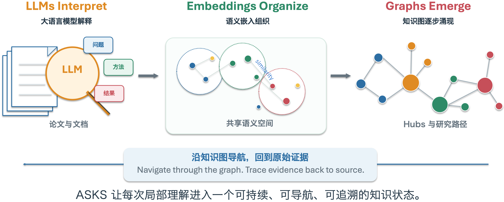
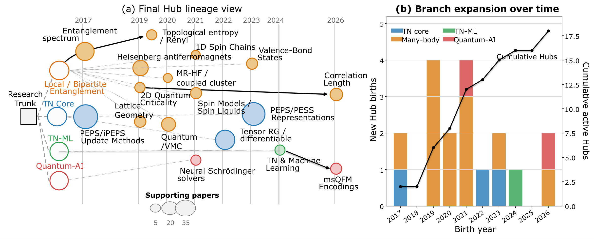

# ASKS 智能知识系统

> **Agent-Driven Scientific Knowledge System**
>
> 让 AI 持续积累、组织和使用知识
>
> *LLMs Interpret, Embeddings Organize, Graphs Emerge*

面向一般读者的项目介绍。本文说明 ASKS（Agent-Driven Scientific Knowledge System，智能体驱动的科学知识系统）如何把分散的论文、文档和研究记录编译成可阅读、可导航、可追溯来源的持续知识系统。

**公开入口：** [GitHub 仓库](https://github.com/ranshiju/Ran-ASKS) | [arXiv:2608.29612](https://arxiv.org/abs/2608.29612) | [下载 PDF 版](ASKS-Chinese-Introduction-2026-09-03.pdf) | [版本对应关系](README.md)

项目中文介绍，2026年9月3日修订。本页是 GitHub 在线阅读版，PDF 保留用于下载和打印。

## 目录

- [摘要](#摘要)
- [快速使用](#快速使用)
- [AI 读过，不等于知识真正积累下来](#ai-读过不等于知识真正积累下来)
- [先用三句话认识 ASKS](#先用三句话认识-asks)
- [1. 大语言模型解释，语义嵌入组织，知识图涌现](#1-llms-interpret-embeddings-organize-graphs-emerge大语言模型解释语义嵌入组织知识图涌现)
- [2. Raw、Wiki 和 Graph](#2-rawwiki-和-graph)
- [3. Graph 如何涌现](#3-graph-如何涌现)
- [4. 面向持续工作的系统工程](#4-面向持续工作的系统工程)
- [5. 从 56 篇论文到研究肖像](#5-从-56-篇论文到研究肖像)
- [结语](#结语)
- [参考文献](#参考文献)
- [参考的开源项目](#参考的开源项目)

## 摘要

ASKS 是一个面向持续知识工作的科学知识系统。它保存论文、会议纪要和普通文档来源，由按来源类型适配的编译器形成可阅读的 Wiki 与来源局部语义，再把所有文档统一编译为可验证的知识 IR 和图计划，经唯一事务性写图器接入持续演化的知识图。会议纪要由同一个 Meeting Compiler 完成口语文本整理、Wiki 编译和语义槽抽取。Wiki 与 Graph 帮助研究者和 Agent 查找概念、论文、主题分支和研究轨迹，重要事实则沿来源链接返回 Raw 中保存的证据。系统同时提供断点续做、失败槽位局部恢复、请求诊断、工程元图和受守卫的 Agent 工具调用。详细方法与实验见已公开论文\[1\]。

## 快速使用

ASKS 可以在具有本地文件访问、命令执行和工具调用能力的 Agent 平台中使用。Codex 和 WorkBuddy 是可选平台示例，具体接入方式随平台而异。ASKS 的共同入口是项目文件、环境配置与 AGENTS.md 中的操作边界。

| **步骤** | **操作** | **说明** |
|:--:|----|----|
| **1** | **打开项目** | 从 GitHub 下载或克隆仓库，在支持本地文件和工具调用的 Agent 平台中打开，例如 Codex 或 WorkBuddy。 |
| **2** | **配置模型服务** | 参照 .env.example 配置主 LLM 与 Embedding。INGEST_BACKEND 独立选择摄入编排；API 模式可用 INGEST_GENERATION\_\* 和 INGEST_PROPOSITION\_\* 分别配置生成与命题抽取模型，未设置时复用主 LLM。 |
| **3** | **让 Agent 读取规则** | 先让 Agent 读取项目根目录的 AGENTS.md，再用自然语言提出摄入、查询、研究或系统建设任务。 |

> **配置与安全**
>
> Embedding 服务可以与 LLM 共用 API 地址和密钥，也可以独立配置。真实 API 密钥只写入本机环境或未纳入版本控制的 `.env`，不应写入文档、代码、日志或提交到 GitHub。

## AI 读过，不等于知识真正积累下来

今天让 AI 读一篇论文并不难。把 PDF 放进对话框，它很快就能给出摘要、解释公式、回答问题。这个过程很容易让人觉得，只要不断把论文交给 AI，知识就会自然积累起来。

当材料从一篇变成几十篇、几百篇，甚至跨越数年的研究记录时，问题就变了。每次对话里的“读懂”通常停留在当次上下文中。AI 未必知道一篇新论文与过去哪些概念相连，哪些内容提供了新证据，哪些只是已有结论的另一种表达，也不会自动形成一张持续更新的整体知识地图。

如果每次开始新任务都重新上传材料、重新解释背景，系统就会一遍遍消耗 Token、时间和费用。更长的上下文可以容纳更多内容，却更像一次性的工作台。会话结束、模型更换或 Agent 平台变化后，之前形成的理解往往难以直接继承。读过很多次，并不等于知识已经被稳定保存、组织和复用。

还有一个更实际的问题。AI 给出的答案可能听起来很完整，研究者仍然需要知道它依据哪篇论文、哪一段原文。缺少清晰的来源路径时，原始事实、模型概括和进一步推断容易混在一起。材料越多，这种混淆越难检查。

ASKS 处理的正是这一层长期问题。它让 LLM 解释单个来源，把结果保存为可阅读的 Wiki 与局部语义，再用 Embedding 和明确规则把新知识接入持续演化的 Graph，同时保留返回 Raw 证据的路径。这样，AI 的每次阅读不再只服务于一次对话，而会成为可积累、可导航、可复查的知识状态。

## 先用三句话认识 ASKS

论文、文档和研究记录不断增加时，真正需要积累的不只是文件数量，还包括对概念、方法、关系和来源的持续理解。跨文献连接知识是一个长期问题\[2\]。ASKS 将每份材料编译成能够被人和 Agent 继续使用的知识状态。

| 持续积累 | 结构导航 | 证据可追溯 |
| --- | --- | --- |
| 每份材料形成可继承的知识状态，后续工作能够从已有理解继续。 | Wiki 和 Graph 组织跨文档知识，其中 Graph 主要负责关联和导航。 | 重要事实沿 Wiki 和 Graph 返回 Raw 中保存的原始材料。 |

> **一句话定义**
>
> ASKS 是一个以来源证据为基础、以 Wiki 和 Graph 为知识结构、支持人和 Agent 持续工作的知识系统。

## 1. LLMs Interpret, Embeddings Organize, Graphs Emerge：大语言模型解释，语义嵌入组织，知识图涌现

这句话概括了 ASKS 中三种彼此配合的计算角色。它们不是三个孤立模块，而是同一知识编译过程在不同阶段承担的分工。

| **计算角色** | **主要输入** | **主要作用** | **形成的结果** |
|----|----|----|----|
| LLM | 当前来源 | 理解语言、提炼局部语义 | Wiki 内容与语义槽 |
| Embedding | 局部语义与已有知识 | 提供共享语义空间 | 相似度、候选关系与组织依据 |
| Graph 规则 | 局部变化与已有图状态 | 执行身份、成员和生命周期规则 | 新的持久图状态 |

### LLMs Interpret：大语言模型负责理解

论文、会议纪要和普通文档首先是写给人看的。它们包含自然语言、公式、图表、术语或口语上下文。大语言模型负责理解当前来源，将材料转化为可阅读的 Wiki 内容和机器能够继续处理的局部语义。会议纪要由同一个 Meeting Compiler 在一次任务中完成口语文本整理、Wiki 编译与语义槽抽取，避免多个执行者重复读取同一份长文本。

不同来源仍使用各自适合的预处理和提示词，但 LLM 输出都会经过结构与语义校验，并编译为统一的知识 IR 和确定性图计划。LLM 负责解释材料，不直接写 Raw、Wiki 或 graph.db，也不会凭一次调用决定整个知识库的最终结构。

### Embeddings Organize：语义嵌入负责组织

Embedding 可以把一段文字或一个知识节点表示为语义空间中的位置。概念越接近，它们在这个空间中通常也越接近。句子级 Embedding 为这种可复用的语义比较提供了成熟方法\[4\]。ASKS 使用共享的 Embedding 空间比较新知识与已有知识，支持节点复用、关系候选、Hub 归属和跨文档组织。

这种分工把大量重复比较交给可批处理、可缓存的数值层。不同 Agent 平台可以在同一个语义组织基础上工作，开放式模型判断则保留给来源理解和高影响语义审查。

### Graphs Emerge：知识图逐步形成

ASKS 中的图不是由某个模型一次性完整绘制出来的。每份新材料只提出一组局部变化。局部变化与已有图状态反复相互作用，主题区域、Hub、分支和研究轨迹由此逐渐形成。

这里的“涌现”指一种可观察的构建过程。系统能够记录哪些来源进入、哪些节点被复用、哪些关系被建立、Hub 在何时出现，以及成员后来如何变化。

## 2. Raw、Wiki 和 Graph

上一节介绍的是计算过程中的角色。本节介绍 ASKS 长期保存和使用的三类信息。它们共同组成知识系统，但承担不同职责。来源保存、来源关系和可复用研究产物的设计参考了 FAIR、PROV-DM 与 RO-Crate 的基本思想\[5-7\]。

| **层** | **保存什么** | **主要读者** | **在事实判断中的角色** |
|----|----|----|----|
| **Raw** | 原始论文、文档、元数据与可定位派生内容 | 人、工具和证据核验流程 | 事实依据 |
| **Wiki** | 面向阅读的解释、摘要、概念和来源链接 | 研究者与语言模型 | 连接原始材料与知识结构 |
| **Graph** | 跨来源节点、关系、Hub、成员与演化记录 | 检索工具、Agent 与分析程序 | 组织知识并引导导航 |

### Wiki：把单份来源变成可阅读知识

Wiki 是面向人和语言模型的编译阅读层。它不只是论文摘要，还可以组织核心问题、方法、概念、结论、局限和来源定位。读者先通过 Wiki 快速理解一份材料，再按需要返回 Raw 核验原文。Wiki 因此连接了保存下来的原始材料与跨来源知识结构。文档与机器可处理语义结合的早期代表包括 Semantic MediaWiki\[8\]。

### Graph：把跨来源关系变成导航结构

Graph 是面向计算和导航的关系层。它记录可复用节点、跨来源关系、Hub、成员归属和演化谱系，使检索工具和 Agent 能够从一个概念进入相关方法、论文与主题区域。知识图的通用方法为这种机器可操作的关系表示提供了基础\[3\]。在 ASKS 中，Graph 的价值主要体现在知识结构和导航质量。它可以保留一定近似性，并通过来源链接、构建记录和后续重编译持续修订。

> **核心边界**
>
> Raw 保存证据，Wiki 承载理解，Graph 组织知识并引导查找。Graph 的任务是帮助用户找到相关内容，事实判断回到原始来源。

这一结构让系统同时面向人和机器。研究者可以阅读 Wiki，程序可以计算 Graph，重要结论则可以沿来源链接返回 Raw。Wiki 和 Graph 都是可修订的编译结果，因此系统能够在保留原始材料的同时更新组织方式。

不同的 Graph 可以像不同图书管理员整理出的书架。分区方式可能不同，但只要它们能够把用户引向相近的相关论文和原始证据，就仍然具有良好的导航价值。ASKS 因此把 Graph 定位为可演化的知识地图，而不是唯一正确的学科分类表。

## 3. Graph 如何涌现

ASKS 将论文、会议纪要或普通文档的一次摄入看作一次从来源到知识状态的编译。不同类型可以保留不同的预处理与提示词，但落图共享同一份中间表示、图计划和事务写入机制。

> **统一编译链路**
>
> 科学材料 -> LLM 解释 -> 验证 GraphDelta -> Embedding 与规则 -> 持续知识状态与来源导航

### 从局部解释到全局结构

第一步，系统保留收到的论文、会议纪要或普通文档，并为其建立稳定的来源标识。第二步，按来源类型适配的编译器生成可阅读 Wiki 和局部语义槽；会议纪要的口语整理、Wiki 与语义槽由单一 Meeting Compiler 一次完成。第三步，校验器把局部输出编译为版本化 Knowledge IR，再生成绑定其哈希的确定性 graph plan。第四步，唯一写图器根据文字证据、Embedding 与明确规则，决定节点复用、创建、关系、来源和 Hub 归属，并以事务方式提交。

图计划通过事务写入后，受影响的节点会重新计算 Hub 归属。若校验失败，系统只把精确错误交给原编译器定向修订，或由受限语义恢复处理失败槽位，同时记录请求诊断，不会静默重跑整条摄入事务。已有主题可以继续吸收知识，尚未被良好覆盖的语义区域可以形成新 Hub。随着材料持续进入，Hub 会扩张并形成可追踪的分支和谱系。

### 三个结构尺度

在节点尺度，系统判断一个新概念是否对应已有知识。在 Hub 尺度，系统判断节点属于哪些主题区域。在时间和层级尺度，系统记录主题何时形成、怎样扩张以及如何连接到已有分支。作者研究肖像、领域发展路径和跨主题导航都建立在这些可追踪变化之上。

> **什么是 Hub**
>
> Hub 是知识图中的持久导航区域，代表积累知识空间中一个相对连贯的部分。Hub 帮助人和 Agent 决定从哪里开始阅读，其成员和边界可以随着知识增长继续修订。

## 4. 面向持续工作的系统工程

持续知识系统需要面对多类型材料、长时间运行、模型变化、批量摄入、失败恢复和多人使用。ASKS 把这些工程要求纳入知识架构，使每次变化都具有明确边界。

| **工程特点** | **对持续知识工作的意义** |
|----|----|
| **来源与派生知识分离** | 原始材料保持稳定，Wiki 和 Graph 可以在明确边界内重新编译。 |
| **写入前验证** | LLM 输出先形成局部语义和可检查变化，通过契约后再进入持久状态。 |
| **文档级事务与回滚** | 一次摄入形成完整事务，硬约束失败时不会留下半完成图状态。 |
| **断点续做** | 长时间摄入、批量重建和外部审计能够从有效检查点恢复。 |
| **重放与版本边界** | 来源、模型、Embedding、规则、阈值和调用顺序可以被冻结并重新执行。 |
| **来源与构建记录** | 节点、关系、Hub 和肖像指标能够追溯到支持它们的论文和构建步骤。 |
| **Agent 分层调用** | 持续工作状态、按需能力和参数化工具彼此分离，Agent 只在需要时加载相应功能。 |

### 统一摄入、局部恢复与模型分工

论文、会议纪要和普通文档的预处理与提示词可以不同，但校验后的语义统一进入 Knowledge IR、确定性 graph plan 和唯一事务性写图器。按来源保存的描述与来源关系参与身份匹配、导航、清理和 Hub 维护。会议纪要只派一个 sub-agent 完成预处理决策、Wiki 编译和语义槽抽取；硬错误最多进行一次带精确反馈的定向修订，避免多个执行者分别改写同一来源。

摄入编排由独立的 INGEST_BACKEND 选择。API 模式还可以通过 INGEST_GENERATION\_\* 和 INGEST_PROPOSITION\_\* 分别指定生成与命题抽取模型；未配置时复用主 LLM。模型只提出受约束的内容，持久化仍由程序校验和统一写入机制控制。

### 工程元图：先确定影响面，再修改系统

科学知识图描述论文、概念和研究关系，工程元图则描述 ASKS 自身。operations/engineering/graph.yaml 把组件、契约、能力和验证关系组织成一张可查询的工程地图。Agent 在建设功能前先运行 engineering_graph.py 的 impact 检查，确定目标会影响哪些组件，以及需要执行哪些最小验证。对于高风险组件，还可以读取简短的输入、输出和写入边界契约。

工程定位器随后按 Markdown 标题、YAML 指针、Python 符号或明确行段读取所需内容。这样，Agent 可以先理解相关局部结构，再修改代码和执行回归。工程元图并不保存科学事实，它的作用是让系统建设本身也具备影响分析、契约边界和可检查的验证路径。

> **两张不同的图**
>
> 科学知识图帮助研究者在知识中导航，工程元图帮助 Agent 在系统组件、契约和验证关系中导航。前者服务科学知识，后者服务系统建设。

### 状态、能力和工具

ASKS 还区分三种 Agent 调用机制。状态表示一项持续工作处于什么上下文，例如研究、摄入或建设。能力表示 Agent 在特定时刻需要加载的行为约定，例如只有真正落笔时才加载写作能力。工具是具有明确参数和结构化返回值的执行函数，例如查询关系、读取来源或更新研究记忆。

这种分层减少了 Agent 每次工作需要携带的上下文，也让调用边界更清楚。知识底座保持持续，具体能力按需进入，工具负责可检查的执行。

### DSH：受守卫的 Agent 驾驶舱

DSH 是 ASKS 中可选的纯 Python Agent 驾驶舱。ToolRegistry 登记可以调用的工具，hook 流水线组织调用前、执行中和调用后的处理，guard 在真正执行前检查权限与边界，SessionLog 记录会话过程，AgentLoop 负责多步工具循环。DSH 借鉴 DeepSeek Harness 的插件化思想，并按照 ASKS 的数据边界独立实现。

查询、摄入、视觉检查、视觉对象化和工程定位分别通过不同的能力入口注册。这样的分离让 Agent 能自动选择合适工具，同时避免把不相关的写入能力暴露给普通查询。DSH 只负责工具编排、守卫和会话记录。实际摄入、检索和图操作仍由底层脚本执行，科学事实仍保存在 Raw、Wiki 和 graph.db 所构成的知识底座中。

## 5. 从 56 篇论文到研究肖像

为了观察知识是否真的能够持续编译并形成全局结构，ASKS 对一个真实研究计划中的56篇正式发表论文进行了完整重建。每篇论文先独立形成来源局部解释，再按正式发表年份进入一个从空状态开始的隔离知识图。

### 知识能否持续积累并形成结构

完整运行形成18个最终 Hub，其中50篇论文能够映射到主要 Hub，6篇论文保留为明确的未映射状态。旧节点的 Hub 成员平均变动率约为0.47%，说明沿这一时间序列形成的主题组织保持低变动。节点复用、多来源支持、Hub 出生和谱系共同构成了一个可以回到具体论文的作者研究肖像。

图 1 由 56 篇正式发表论文编译得到的作者研究肖像。图中主题、出生年份、论文支持和谱系来自冻结图记录，宏观领域用于帮助阅读。

肖像显示出持续的张量网络方法核心，以及向量子多体研究、张量网络机器学习、量子计算和量子 AI 方向的扩展。它不是对研究者的主观评价，而是对论文支持、Hub 演化和图结构性质的来源可追溯描述。

### 形成的结构是否具有语义和导航意义

外部验证采用两类互补参照。APS 的 Physics Subject Headings 为部分物理论文提供稳定但覆盖有限的学科标签。它对概念层结构给出方向性一致信号。另一个盲法导航实验使用两个独立模型家族。模型只看到 Hub 标签和匿名论文标题、摘要，需要在真实支持论文和匹配对照之间做选择。

两个模型覆盖全部18个 Hub，成员识别的 Hub 宏平均为0.774，而随机参照为0.5。两个模型的主要得分接近。这个结果说明，外部模型能够从来源受限的论文证据中识别多数 Hub 的导航含义。模型不参与 Hub 构建，也不作为事实来源。

### 改变摄入顺序后会发生什么

顺序重建实验固定56份论文解释、Embedding、规则和参数，只改变同一年论文进入 Graph 的先后顺序。七组重建包括一次原顺序复现、一次同年逆序和五个同年随机顺序。原顺序能够精确复现冻结图的规范化结构。

六个扰动顺序最终形成18至21个 Hub。底层节点复用和多来源整合比例几乎不变，外部语义一致性也保持在相近范围。具体 Hub 成员的最佳匹配度为0.379至0.669，论文映射覆盖率为67.9%至83.9%，低于原顺序的89.3%。

这些结果显示，ASKS 在不同顺序下积累了相近规模和语义方向的知识，但中层主题边界会保留构建历史。Graph 的具体布局具有路径依赖，来源导航与宏观肖像是否保持等价则构成下一阶段的直接实验问题。

| **实验问题** | **主要观察** | **通俗含义** |
|----|----|----|
| 知识能否持续形成结构 | 56篇论文形成18个最终Hub，50篇论文进入最终研究树，旧节点成员平均变动率约为0.47%。 | 知识图能够沿真实时间序列逐渐形成低变动的主题结构。 |
| 结构是否具有语义和导航意义 | 两个独立模型在盲法成员识别任务中的Hub宏平均为0.774，随机参照为0.5。PhySH提供覆盖有限的方向性参照。 | 外部读者能够仅凭Hub标签和论文证据识别多数导航关系。 |
| 顺序改变后哪些性质保留 | 六个同年内扰动顺序产生18至21个Hub。底层复用与整合比例几乎不变，精确Hub成员匹配度为0.379至0.669。 | 系统积累了相近知识，但会形成不同的合理书架布局。 |

> **实验给出的整体认识**
>
> 低层知识编译具有较稳定的统计性质，宏观语义组织具有部分稳定性，具体 Hub 结构会受到构建路径影响。ASKS 以来源可追溯的导航价值评价 Graph，而不是要求每次构建得到唯一相同的树。

## 结语

ASKS 希望为人和 Agent 提供一个可以长期继承的知识基础。材料被局部理解，知识在共享语义空间中持续组织，Graph 随积累逐渐形成。研究者可以沿 Wiki 和 Graph 找到相关主题、论文和路径，并在需要事实判断时返回保存的来源证据。

这种架构适合个人长期研究、团队知识积累、跨文献调研、科研写作和科学 Agent 工作流。它把一次次独立的材料处理连接成连续知识状态，让后续工作真正建立在过去形成的理解之上。

## 参考文献

[1] S.-J. Ran, K. Zhang, X. Wu, L.-S. Yang, and W.-J. Li, “LLMs Interpret, Embeddings Organize, Graphs Emerge: Agent-Driven Compilation of Scientific Knowledge,” arXiv:2608.29612 (2026). [arXiv:2608.29612](https://arxiv.org/abs/2608.29612)

[2] D. R. Swanson, “Undiscovered Public Knowledge,” The Library Quarterly 56, 103-118 (1986). [doi:10.1086/601720](https://doi.org/10.1086/601720)

[3] A. Hogan et al., “Knowledge Graphs,” ACM Computing Surveys 54, Article 71 (2021). [doi:10.1145/3447772](https://doi.org/10.1145/3447772)

[4] N. Reimers and I. Gurevych, “Sentence-BERT: Sentence Embeddings using Siamese BERT-Networks,” EMNLP-IJCNLP, 3982-3992 (2019). [doi:10.18653/v1/D19-1410](https://doi.org/10.18653/v1/D19-1410)

[5] M. D. Wilkinson et al., “The FAIR Guiding Principles for scientific data management and stewardship,” Scientific Data 3, 160018 (2016). [doi:10.1038/sdata.2016.18](https://doi.org/10.1038/sdata.2016.18)

[6] L. Moreau and P. Missier, eds., “PROV-DM: The PROV Data Model,” W3C Recommendation (2013). [W3C PROV-DM](https://www.w3.org/TR/2013/REC-prov-dm-20130430/)

[7] S. Soiland-Reyes et al., “Packaging research artefacts with RO-Crate,” Data Science 5, 97-138 (2022). [doi:10.3233/DS-210053](https://doi.org/10.3233/DS-210053)

[8] M. Krötzsch, D. Vrandečić, M. Völkel, H. Haller, and R. Studer, “Semantic Wikipedia,” Journal of Web Semantics 5, 251-261 (2007). [doi:10.1016/j.websem.2007.09.001](https://doi.org/10.1016/j.websem.2007.09.001)

## 参考的开源项目

ASKS 同时使用或参考了若干开源项目。下表区分直接工具依赖、特定用途依赖和设计模式借鉴，并说明具体融合位置。项目当前代码、版本记录和各上游许可证是依赖关系的最终依据。

| **项目** | **参考层次** | **在 ASKS 中的关系** |
|----|----|----|
| [MinerU](https://github.com/opendatalab/MinerU) | **直接工具依赖** | 作为论文 PDF 的首选结构化提取引擎。56 篇论文冻结实验均使用 MinerU 产物。 |
| [DeepSeek Harness](https://github.com/deepseek-ai/deepseek-harness) | **设计思想借鉴** | 借鉴 Everything is a Plugin 的插件化工具、hook 和 guard 思路。DSH 为独立纯 Python 实现，不依赖 Cordis 运行时。 |
| [Semantica](https://github.com/semantica-agi/semantica) | **模式借鉴** | 参考声明式约束、来源记录和时间有效性模式，并适配到 ASKS 自身的图模式与单一图存储边界。 |
| [Docling](https://github.com/docling-project/docling) | **可选工具依赖** | 在用户明确选择较低优先级解析路径时提供本地文档解析，不替代冻结论文实验的 MinerU 提取边界。 |
| [PyMuPDF](https://github.com/pymupdf/PyMuPDF) | **特定用途依赖** | 用于 PDF 元数据读取、页面渲染、来源定位和视觉产物处理等确定性操作。 |
| [python-pptx](https://github.com/scanny/python-pptx) | **特定用途依赖** | 用于生成和处理对象可编辑的 PPTX 产物，包括视觉对象化工作流。 |

**项目资源：** [GitHub 仓库](https://github.com/ranshiju/Ran-ASKS) | [arXiv 论文](https://arxiv.org/abs/2608.29612)

说明：本文统一使用 ASKS 作为项目名称。ASKS 的英文全称为 Agent-Driven Scientific Knowledge System。本介绍初版日期为2026年9月1日，2026年9月3日修订工程机制说明，对应 Ran-ASKS v0.3.0 主分支；本次文档同步不改变版本号。实验数字来自冻结的56篇论文重建、外部语义与导航审计，以及七组同年内顺序重建记录。arXiv v1（arXiv:2608.29612）对应 Ran-ASKS v0.2.0 与论文数据产物1.0.0。外部语义与导航审计对应 Ran-ASKS v0.2.1 与增量数据产物1.1.0。七组同年内顺序重建属于 arXiv v1 之后的投稿工作结果，尚未纳入上述冻结公开产物。
